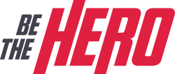
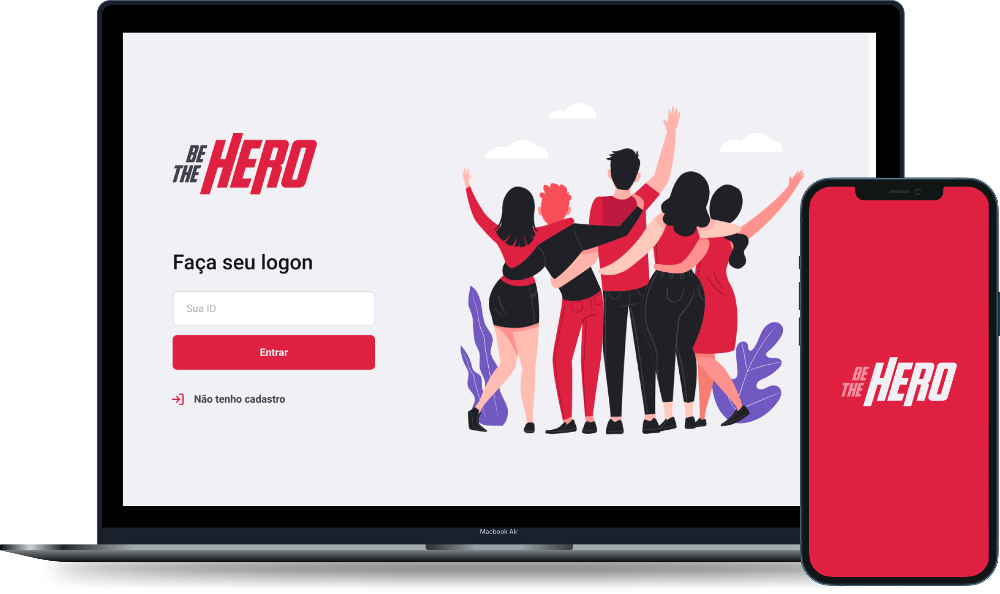

<h1 align="center">
    
</h1>

<h6 align="center"> 
  Project Delevoped in Rocketseat Omnistack 11🚀
</h6>
<h5 align="center"> 
 🚧 Project in Development 🚧
</h5>

<p align="center">

  

  
	
  
  <a href="https://github.com/henriqueaanjos/bethehero/commits/master">
    
  </a>
  

  
   <a href="https://github.com/henriqueaanjos/bethehero/stargazers">
    
  </a>
</p>

<p align="center">
  <a href="#-About-Project">About</a>&nbsp;&nbsp;&nbsp;|&nbsp;&nbsp;&nbsp;
  <a href="#-Layout">Layout</a>&nbsp;&nbsp;&nbsp;|&nbsp;&nbsp;&nbsp;
  <a href="#-Features">Features</a>&nbsp;&nbsp;&nbsp;|&nbsp;&nbsp;&nbsp;
  <a href="#-Technologies">Technologies</a>&nbsp;&nbsp;&nbsp;|&nbsp;&nbsp;&nbsp;
  <a href="#-Requirements">Requirements</a>&nbsp;&nbsp;&nbsp;|&nbsp;&nbsp;&nbsp;  
  <a href="#-Instructions">Instructions</a>&nbsp;&nbsp;&nbsp;|&nbsp;&nbsp;&nbsp;
  <a href="#-License">License</a>
</p>

<p align="center">
    
</p>


## 💻 About Project
  This project was developed thinking about connecting NGOs that need help with possible collaborators and donors. 
Through Be The Hero, NGOs can register cases in which they are working and in need of help, informing:
  - The Title of the Case,
  - A description of the Problem,
  - The amount of the donation you would like to request in BRL.

  With this platform, it will be much easier to connect people interested in helping, to Organizations and cases that move you. Interested parties can do this via the mobile app, choosing a case and contacting us via:
  - Whatsapp
  - Email

## 🎨 Layout
  The complete Layout can be accessed on figma in this link:
  <a href="https://www.figma.com/file/2C2yvw7jsCOGmaNUDftX9n/Be-The-Hero---OmniStack-11?node-id=0%3A1">
    
  </a>
  
  This layout was developed by <a href="https://rocketseat.com.br">Rocketseat 🚀</a> for Omnistack Week 11
  
## 🛠 Tecnologies

This project was developer with belong tecnologies:

- [Node.js](https://nodejs.org/en/)
- [Knex.js](https://knexjs.org)
- [Express](https://expressjs.com)
- [SqLite3](https://www.sqlite.org/index.html)
- [React](https://reactjs.org)
- [React-Native](https://reactnative.dev)
- [Expo](https://expo.dev)
- [Styled-components](https://styled-components.com)

## 🚨 Requirements

To run this project you will need to have the following tools installed on your machine:
- [Node.js](https://nodejs.org/en/)
- [Git](https://git-scm.com)

## 🧭 Instructions
### 🎲 Backend
```bash
# Clone este repositório
$ git clone https://github.com/henriqueaanjos/beTheHero.git

# Acesse a pasta do projeto no terminal/cmd
$ cd beTheHero

# Vá para a pasta server
$ cd backend

# Instale as dependências
$ npm install

# Execute a aplicação em modo de desenvolvimento
$ npm run start

# O servidor inciará na porta:3333 - acesse http://localhost:3333 
```

### 💻 Frontend
```bash
# Clone este repositório
$ git clone https://github.com/henriqueaanjos/beTheHero.git

# Acesse a pasta do projeto no seu terminal/cmd
$ cd beTheHero

# Vá para a pasta da aplicação Front End
$ cd frontend

# Instale as dependências
$ npm install

# Execute a aplicação em modo de desenvolvimento
$ npm run start

# A aplicação será aberta na porta:3000 - acesse http://localhost:3000
```
### 📱Mobile

 🚧 Under development 🚧
 
## 📖 License
This project is under the MIT license. See the <a href="/license">LICENSE</a> file for more details.

---
<p align="center">
  by Henrique Anjos with ❤️
</p>
<p align="center">
  <a href="https://www.linkedin.com/in/henrique-aanjos">
    
  </a>
  <a href="https://www.instagram.com/henriqueaanjos/">
    
  </a>
</p
